# GPU Optimization Tutorial 

## **Introduction**

<details>
  <summary><b>Background</b></summary>
<br>
This tutorial is based off of Layaa’s script that splits whole slide images (.svs) into 256 x 256 tiles. Tiles are assessed and those with poor contrast and variation (aka likely background) are filtered out. Remaining tiles’ embeddings and coordinates are ran through the pretrained GigaPath model which will output slide-level embeddings. These embeddings along with the tile’s position are captured in a tsv for future processing. 
<br><br>
Layaa was running this script on 4 huge datasets, with each dataset containing ~ 1000-3000 images. Images were split into batches of five and each image was very big, with a height and width easily in the range of 15k to over 100k. 
<br><br>
This script was ran as an SBATCH job and each job was one batch of .svs images. Jobs were submitted using a job array. 
<br><br>
</details>

<details>
  <summary><b>Getting Started</b></summary>
<br>
This tutorial assumes you have conda and you have knowledge on how to pull from a Git repository. 

If you’re unsure, refer to: 

https://docs.conda.io/projects/conda/en/latest/user-guide/install/index.html

https://docs.github.com/en/get-started/using-git/getting-changes-from-a-remote-repository

</details>


<details>
  <summary><b>Data Input</b></summary>
<br>
For the purposes of this tutorial, we are using whole-slide images from breast cancer tissue samples. 

We have cropped images to a more manageable size of 15k x 15k pixels. 
We will be using 2 batches, with each batch consisting of 2 images to also demonstrate the utility of the job array. 

An example of what one image looks like is below: 

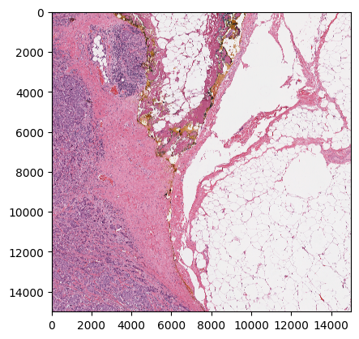

</details>

## **Preparing to Run Tutorial**

<details>
  <summary><b>Obtaining Files and Environment</b></summary>
<br>
Please do all of this in gscratch! 

The steps are as follows: 

1. Pull all the files from the GPU Opt github: 

    ```
    git clone https://github.com/ohsu-cedar-comp-hub/GPUOptTutorial.git
    cd GPUOptTutorial
    ```

2. Confirm that your current working directory is the GPUOptTutorial directory. 
3. To simplify set up of the correct environment, I put the direct path to my environment in the launch script, `launch.sh` so no need to set it up yourself. 

<br>

TIP: Want to set up the environment for yourself? Move to **Creating Environment**. 
</details>


<details>
  <summary><b>Obtaining the Data</b></summary>
  <br>

Pull the data into GPUOptTutorial directory by creating a symbolic link. 

```
ln -s /home/exacloud/gscratch/CEDAR/chaoe/gpu_opt/TCGA-BRCA .
```

In the TCGA-BRCA folder, you'll have 3 folders:
- TCGA_BRCA-batch_1
- TCGA_BRCA-batch_2 
- TCGA_BRCA-batch_test

TCGA_BRCA-batch_1 and 2 contain 2 images of 15k x 15k pixels each and will be used for the main tutorial. 

TCGA_BRCA-batch_test contains 1 small image. 
This image will be used for a small test job in **Why nvidia-smi?: Impact of Not Using Your GPU(s)**. 


</details>

<details>
  <summary><b>Obtaining HuggingFace Token</b></summary>
<br>
You will need an individual user token in order to access the pretrained Gigapath models in HuggingFace. 

1. Create an account in HuggingFace if you don't already have one. (https://huggingface.co)
2. Get access to the Gigapath models by accepting the conditions here: https://huggingface.co/prov-gigapath/prov-gigapath. 
3. Go to Settings and Access Tokens to create a new user token. 

    **Make sure that you enable read access to contents of all public gated repos you can access.**

4. Keep your generated user token elsewhere so you can use it in this tutorial. 

</details>


<details>
  <summary><b>Setting the Cache</b></summary>
<br>
With HuggingFace, you can specify the cache directory where you want your models to be stored. 
By default, it is on your head node which is NOT ideal as it results in slower loading time and also takes up more space in your head node which can lead to disk quota exceeded issues! 

As a result, we will do the following: 
1. Create a new cache directory in your GPUOptTutorial directory (in gscratch). 
2. Set the full path of cache directory as the HF_HOME variable in your bashrc file. 

    ```
    cache=/home/exacloud/gscratch/CEDAR/[user]/GPUOptTutorial/[cache dir]
    mkdir -p "$cache"

    nano ~/.bashrc
        export HF_HOME=/home/exacloud/gscratch/CEDAR/[user]/[cache dir]

    source ~/.bashrc
    ```

TIP: Want to see more information regarding why I put HF cache in gscratch? Move to **Changing Location of Cache**


</details>

<details>
  <summary><b>Final File Structure </b></summary>
  <br>
Now, this is what your file structure should look like when you run 

```
cd GPUOptTutorial
tree
```

</details>


## **Launching the Tutorial**

<details>
  <summary><b>Launch Script Breakdown</b></summary>
<br>

Our launch script is titled `launch.sh`. We will use these already present sbatch parameters: 

```bash
#!/bin/bash
#SBATCH --partition gpu
#SBATCH --account CEDAR
#SBATCH --gres=gpu:a40:1    
#SBATCH --array=1-2%2
#SBATCH --cpus-per-task 1
#SBATCH --mem 20G
#SBATCH --time 1:00:00
#SBATCH --job-name gpu_opt_tut
```

Let's break these parameters down line by line: 
1. --partition gpu -> We are running on the gpu partition. 
2. --account CEDAR -> We are using the CEDAR account. 
3. --gres=gpu:a40:1 -> We are requesting 1 A40 GPU. It is good practice to specify which GPU we want as some partitions have mixed types of GPU. 
4. --array=1-2%2 -> We are setting up a job array. Syntax goes as follows: [range of jobs]%[# of jobs ran in parallel]. In this case, we want 2 total jobs so 1-2 and we want both to run in parallel. 
5. --cpus-per-task 1 -> This is a simple task and we are also utilizing a GPU so 1 CPU should be enough. 
6. --mem 20G -> This is an arbitrary memory setting of 20 GB. 
7. --time 1:00:00 -> This is also an arbitrary timelimit setting of 1 hour. 
8. --job-name gpu_opt_tut -> We are setting a job name that is relevant and easy to remember if needed later. 


Inside the launch script, it calls the following: 

```bash 

eval "$(conda shell.bash hook)"
conda init
conda activate /home/exacloud/gscratch/CEDAR/chaoe/miniconda3/envs/gigapath

CACHE=""
while [[ $# -gt 0 ]]; do
    case $1 in
        -c)
            CACHE="$2"
            shift 2
            ;;
        -hf)
            HF_TOKEN="$2"
            shift 2
            ;;
        *)
            echo "Incorrect option: $1"
            exit 1
            ;;
    esac
done

if [[ -z "$HF_TOKEN" ]]; then
    echo "Error: HuggingFace token (-hf) is required."
    exit 1
fi


python scripts/script.py -id TCGA-BRCA/TCGA-BRCA-batch_${SLURM_ARRAY_TASK_ID} -hf $HF_TOKEN -lf log/TCGA-BRCA/TCGA-BRCA-batch_${SLURM_ARRAY_TASK_ID} -o results/ -c $CACHE


```

To quickly break this down: 
1. We are initializing conda for use in the current Bash shell session.
2. We are activating my conda environment using a direct path to my environment. 
3. The user-specific hugging face token (-hf) and the cache directory (-c) arguments are expected to be given during launch of script to be used in script.py. 
4. We are running the script (script.py) with its required arguments:  

    The image directory (-id) is TCGA-BRCA/TCGA-BRCA-batch_${SLURM_ARRAY_TASK_ID}. We are using a job array, so there are two image directories we are running in parallel. 
    
    The hugging face token (-hf) is user-specific and provided during launch of script. It was previously generated in an earlier section. 

    The path for the log files (-lf) is log/TCGA-BRCA/TCGA-BRCA-batch_${SLURM_ARRAY_TASK_ID}.log. 

    The output directory will be results/ . 

    The cache argument will be filled in if it is provided during launch of script. We had previously created a variable $HF_HOME that is our new cache directory. 

TIP: Want a more detailed breakdown of what’s happening in script.py? Move to **Detailed Breakdown of Script (script.py)**. 

</details>
<br>

We will launch the job array by running this command: 

`sbatch scripts/launch.sh -c $HF_HOME -hf [usertoken]` . 

Confirm that the job array is functioning properly by using `squeue -u [user]`. 
You can also check progress with the log file(s). 

Log files are called log/TCGA-BRCA/TCGA-BRCA-batch_${SLURM_ARRAY_TASK_ID}.log. 


## **Tracking and Optimizing the Jobs**

Often, we have no idea the amount of resources our jobs need. A good litmus test is to track the usage and efficiencies of the resources requested on a smaller test job. This is exactly what we are doing in this tutorial. 

<details>
  <summary><b>GPU Usage and Optimization </b></summary>
<br>
While your job is running, follow these steps to view your GPU usage. 

1. SSH into the compute node(s) your job is running on. Find what compute node(s) by looking at `squeue -u`. 

    ```
    ssh cnode-00-00 
    ```

2. Run nvidia-smi. I like to use watch to get real time updates as the job runs. 
    ```
    watch nvidia-smi
    ```

Refer to **Why nvidia-smi?: Impact of Not Using Your GPU(s)** to learn more and to see a test example of what happens when you don't use the GPU(s) you request. 


For example, this is what I saw when I did this a few minutes into my jobs: 

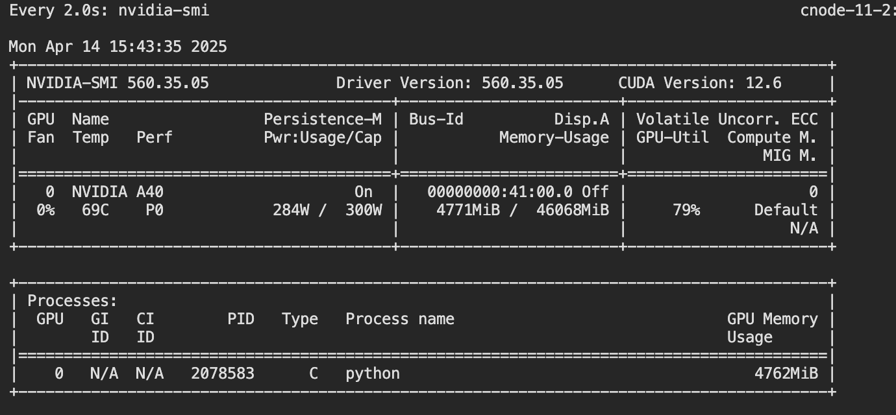

From a quick glance, we can confirm that we are using our GPU! We can tell that we are using CUDA, and that we are using the a40 GPU. 

Looking at GPU utilization, we can see the percentage of time the streaming multiprocessors (SMs) were running over a sampled time period. In this moment, 79% were used. 

Because the GPU utilization varies over a sampled time period and will change depending on what’s occurring in the job, this number should be taken with a grain of salt. The main focus is whether the GPU(s) is actually being used at all and if the GPU utilization is very low. 

If your GPU utilization is very low, that means that your GPU is not being fully utilized or is idle. 

There could be many causes behind this, but a common one is that the GPU is being bottlenecked by slow data loading. The utilization can also be bottlenecked by inefficient code, overloaded CPU(s) and/or memory limits. 

One solution that people default to is to increase the batch size to potentially improve your GPU optimization. I would approach that solution with caution however as that also increases the amount of data you will be loading in, so CPU optimization is also really important. 

TIP: Check if you have slow data loading by using the time module to track it! 

</details>

<details>
  <summary><b>CPU Usage and Optimization</b></summary>
<br>
As mentioned above, GPU efficiency is also heavily dependent on CPU efficiency and optimizing your CPUs are a lot easier! 
<br><br>
You can track the usage and efficiency of your CPU(s) from a past job using a handy SLURM job assessment tool that can be obtained here: https://github.com/ohsu-cedar-comp-hub/SlurmStats. 

This tool also displays time and memory efficiencies. 

This tool generates a report that allows you to check your CPU, memory and time efficiency. In the case of this tutorial, I got these stats back: 

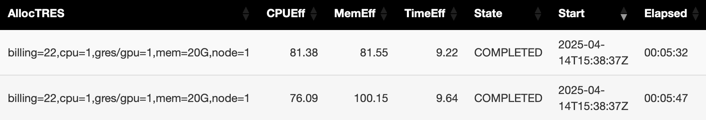

So from the above, the requested 1 CPU was appropriate. The 20 GB memory requested was also appropriate. The only thing that could use a big change is the requested time limit since these jobs only took around 5 minutes. 

TIP: A good rule of thumb is to aim for > 50% efficiency! 

</details>

## **Other Information**

<details>
  <summary><b>Creating Environment</b></summary>
<br>
First, ensure you are starting this from an environment with python <= 3.12.2. 

Next, you will follow the install instructions from the gigapath github README. (https://github.com/prov-gigapath/prov-gigapath )

**NOTE**: You should NOT install gigapath on a GPU node as stated in their README. Instead, perform the installation instructions on an interactive node.

Then run this block of code below, making sure to install everything in the same gigapath environment.
You should be all set at this point! 


**BUT** if you run into a torch pip subprocess error such as this one:

```
Pip subprocess error:
error: subprocess-exited-with-error

× python [setup.py](http://setup.py/) egg_info did not run successfully.
│ exit code: 1
╰─> [8 lines of output]
Traceback (most recent call last):
File "<string>", line 2, in <module>
File "<pip-setuptools-caller>", line 35, in <module>
File "/tmp/pip-install-uns2lrhc/flash-attn_f3eee864c5924a33840bca034ff69402/setup.py", line 19, in <module>
import torch
File "/home/exacloud/gscratch/CEDAR/chaoe/miniconda3/envs/gigapath_testing_06_23/lib/python3.9/site-packages/torch/**init**.py", line 229, in <module>
from torch._C import *  # noqa: F403
ImportError: /home/exacloud/gscratch/CEDAR/chaoe/miniconda3/envs/gigapath_testing_06_23/lib/python3.9/site-packages/torch/lib/libtorch_cpu.so: undefined symbol: iJIT_NotifyEvent
[end of output]

note: This error originates from a subprocess, and is likely not a problem with pip.
error: metadata-generation-failed

× Encountered error while generating package metadata.
╰─> See above for output.

note: This is an issue with the package mentioned above, not pip.
hint: See above for details.

failed

CondaEnvException: Pip failed

```

You will need to uninstall and reinstall fresh torch modules and add in the packages that were missed.  


```
pip uninstall torch torchvision torchaudio
pip3 install torch torchvision torchaudio --index-url https://download.pytorch.org/whl/cu118

conda install anaconda::pandas
conda install conda-forge::timm
conda install anaconda::tifffile
pip install tiler

```

</details>

<details>
  <summary><b>Detailed Breakdown of Script (script.py)</b></summary>
<br>

**INPUT:** Path to Directory of Whole Slide Images (.svs), Hugging Face Token, Path to Log File, Path to Results Directory, Path to Cache Directory

    For each image in the image directory: 

        1. New ImageCropTileFilter object is created. 

        - Image is read in using Tifffile library.
        - Time taken to read image is printed to log file.
        - Obtain information of the cancer type, image file name, sub id etc from the image file name.

        2. Load the gigapath model using the hugging face token and the cache directory. 

        - Time taken to load model is printed to log file.
        - Explicitly set torch device to cuda.
        - Create an array of transformations to be applied later
            - resize image so shorter side is 256 pixels
            - crops a 224 x 224 square from image’s center
            - converts image into PyTorch tensor
            - normalizes RGB using predetermined mean and standard deviation

        3. Crop the image to ensure its dimensions are divisible by 256. 

        4. Tile the image into 256 x 256 tiles. 

        5. For each tile: 

            Record the tile’s position coordinates in the image. 

            Record the number of unique pixel values in the tile and their occurrences as array. 

            Calculate the 5th percentile and 50th percentile of pixel values. 

            Filter the tile based on if it’s likely to be background or if it has the tissue: 

            If likely tissue aka has lots of contrast, tile must pass these conditions: 

            - smallest unique pixel value < 135 (some dark pixels)
            - largest unique pixel value ≥ 255 (some bright pixels)
            - 5th percentile is < 162 and 50th percentile < 225 (not too bright/washed out)

            Tile marked as tissue is converted into PIL Image object. 

            Array of transformations is applied and tile becomes an RGB image. 

            Tile is ran through gigapath model. 

            The output (slide-level embeddings) and metadata of tile is saved to a dataframe in the results directory. 

            If likely background, tile is ignored and not saved. 

**OUTPUT:** Log File, Dataframe of Processed (Likely Tissue) Tiles 


</details>

<details>
  <summary><b>Why nvidia-smi?: Impact of Not Using Your GPU(s)</b></summary>
<br>
When running a job that requires a GPU, it is imperative to confirm that you are actually using your GPU(s)! 

Let's run a small test job where we won't use the GPU and see what happens! 

I've selected a very small test image with size of 2.5k x 2.5k as input so that this job can be ran in one sitting even without GPU. 

This image is in TCGA_BRCA-batch_test. 


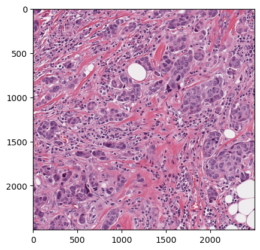


Run the below: 

```
sbatch scripts/mini_error.sh -c $HF_HOME -hf [usertoken]

```
The launch script and the py script it calls ,`mini_script_error.py`, are identical to `launch.sh` and `script.py` except for one key line where the pytorch tensor is NOT explicitly switched to cuda. 
Now, do the following: 
1. Use `squeue -u [user]` to confirm that the job ran and to find the compute node its on. 
2. Do `ssh cnode-x-x` and then `watch nvidia-smi` to track GPU usage and see if GPU is being utilized.

I've included what I saw below! As you can see, no running processes were found and there was consistently 0% GPU utilization because the GPU was not being used. 

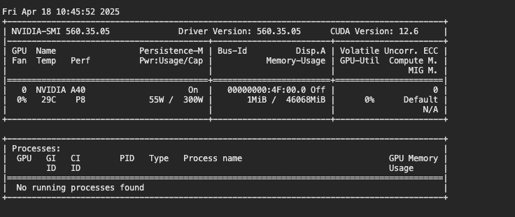

The job was still able to complete, it just took a lot longer than it would have! 

Let's compare by running this same image on the correct launch script and py script. 

To do so: 
1. Comment out the existing python call line and replace with 
    ```
    python scripts/script.py -id TCGA-BRCA/TCGA-BRCA-batch_test -hf $HF_TOKEN  -lf log/TCGA-BRCA/TCGA-BRCA-batch_testing -o results/ -c $CACHE
    ```
2. Remobve the SBATCH job array parameter as we do not need a job array for this single image. 

3. Now run: 
    ```
    sbatch scripts/script.sh $HF_HOME 

    ```

Use the Slurm Stats Tool previously mentioned to compare the time elapsed! 

The job took around 4 1/2 minutes, while with GPU, it would have taken only 27 seconds! 

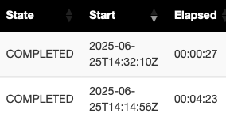

Since the job was so small and was still able to finish with only CPU, it may not have raised any suspicion that it wasn’t using GPU. But, it would have been a lot faster if it had! This is why it’s important to ensure that the resources we request are actually being used! 

If this small image was expanded back to its original whole slide image size, we can quickly see just how drastic the difference between using only the CPU and using both the CPU and GPU is! The difference is even more drastic if we imagine that we have a full dataset of this image to process! 

The full dataset consists of 622 batches of 5 images. These numbers were chosen to directly match the number of BRCA images Layaa had. 

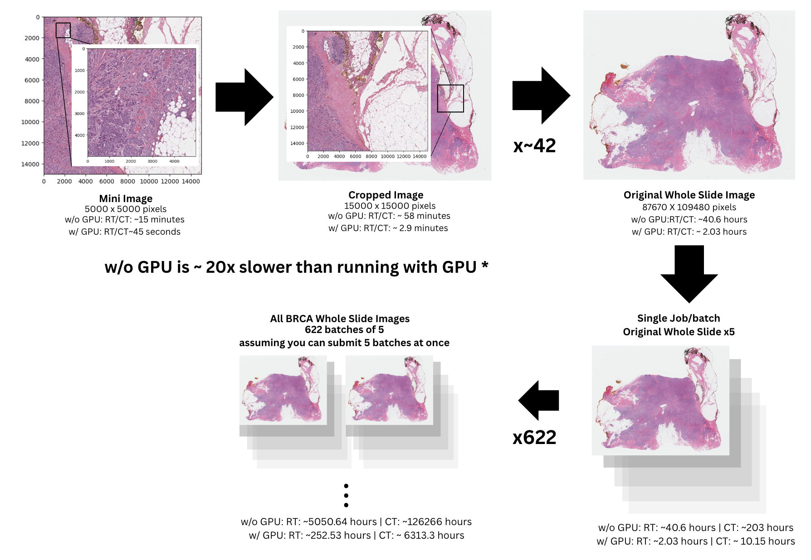

This visual is under two assumptions: 

1. As the small image is expanded back, the computation time it takes increases proportionally to the new image size. 
2. All images in each batch and in the entire BRCA dataset are the same. 

While these assumptions result in a likely exaggerated CT (computation time), this visual still gives a good look at how drastic a 10x difference can be when you apply it to your real workflow. 

This difference was only 10x for this analysis but could  be a lot more depending on how busy the cluster is, what your analysis is and how big the data is!

It is highly recommended to use a small test job to start off with to test that the script runs and that the resources requested are being used!

</details>

<details>
  <summary><b>Using LegacyGPU Partition</b></summary>
<br>
Because this tutorial is not computationally intensive, I wanted to test the effect of using a less powerful gpu via the legacygpu partition. 

Below, is an output I see when I run `watch nvidia-smi`  . 

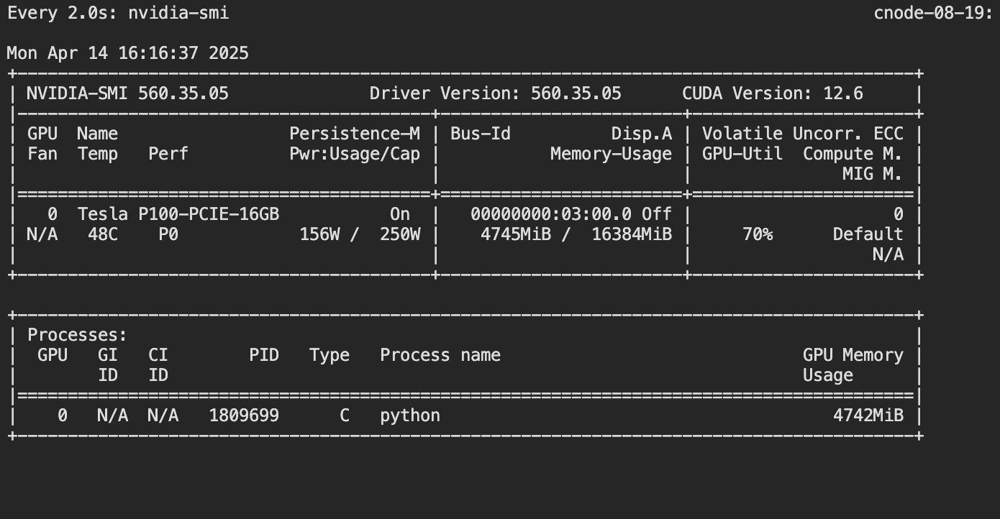

Remember that the GPU utilization is variable and dependent on where the job is at the moment, so the utilization needs to be taken with a grain of salt. 

From looking at the SLURM job assessment tool and using the time module to log the time for loading the data, and loading the model, we can see that the legacygpu partition does take ~2x longer. 

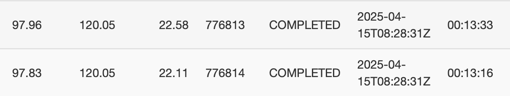

This is likely because legacygpu has older GPUs and older CPUs. We can compare the CPU versions below: 

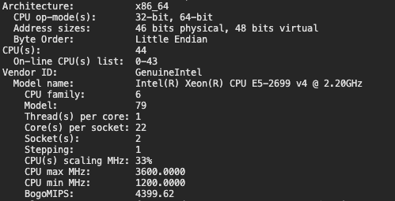

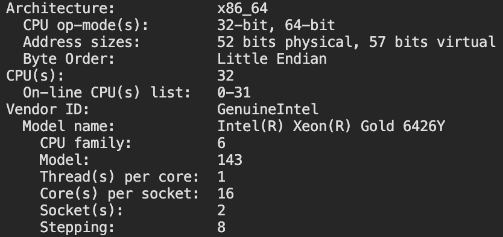

Refer to the below table to learn more about the different gpu partitions and their specs. 

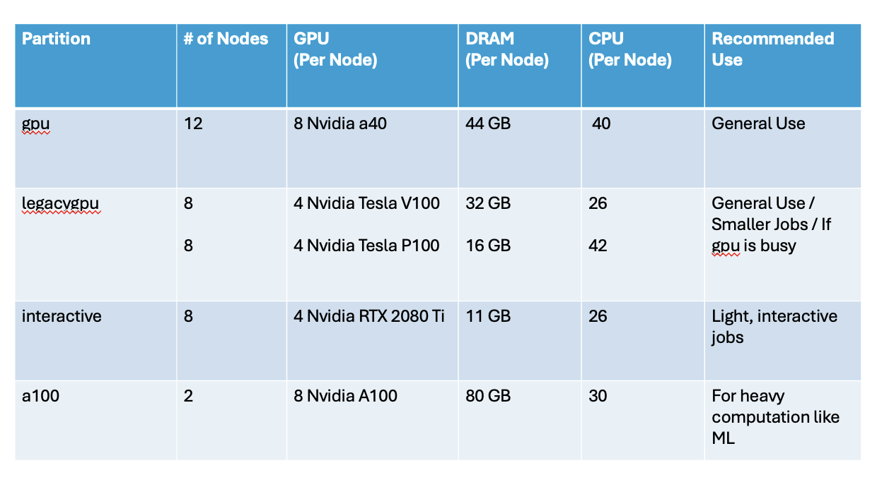

Because it does take a job longer to run on the legacygpu partition, I’d recommend using it for jobs that aren’t urgent and if the wait is too long for the gpu partition. 

Alternatively, it could be useful to start off running your job on the legacyGPU partition first, and then, if you get a CUDA out of memory error, you could move up to the a40 GPUs in the gpu partition. 

TIP: To check how busy these partitions are, use sinfo!

</details>

<details name="change-cache">
  <summary><b>Changing Location of Cache</b></summary>

<br>
The huggingface cache by default is present in your head node at /home/users/[yourname]/.cache/huggingface/hub. 

You can change where you want the cache to be when you first load in the model and I propose putting the cache in your gscratch. 

There are 2 main reasons: faster loading speed from gscratch and to prevent the cache from filling up your disk quota. 

I tested whether it truly provides faster loading speed by using the time module to track the loading difference. 

First from loading with the default, we can see that loading the model for the first time takes 53 seconds and then the second time it takes around 14 seconds. 

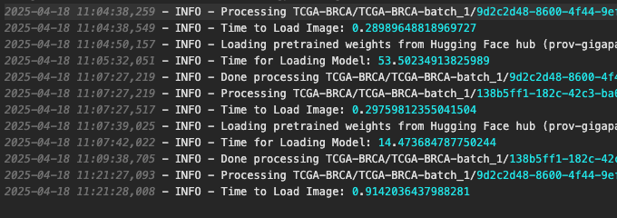

Loading with the cache directory in gscratch makes it a lot easier to access so now loading the model takes less than 20 seconds. 

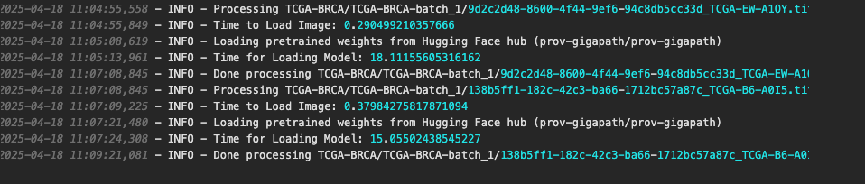

We see a similar advantage with the legacygpu partition, although the advantage is less pronounced. 

Again, loading from the default takes almost a minute and a half the first time. In contrast, loading with the cache in gscratch takes a little more than a minute the first time. 

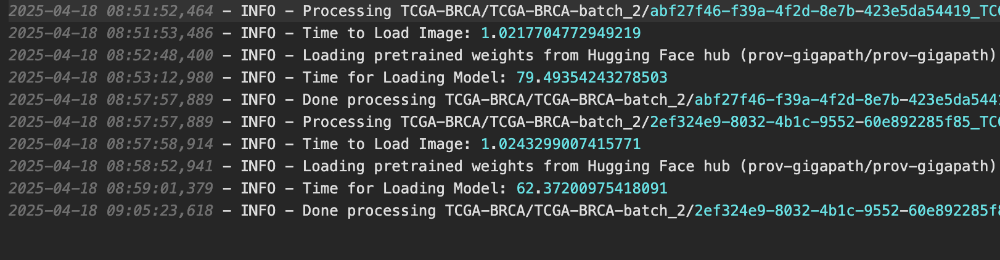

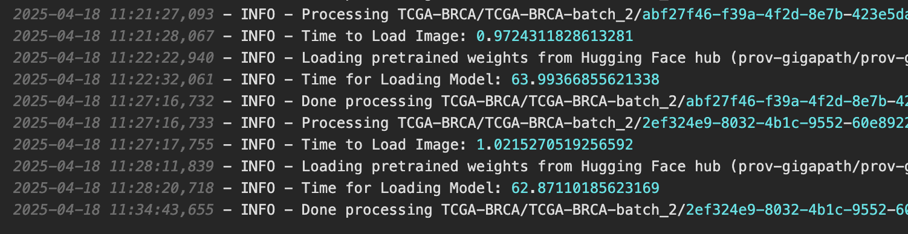

NOTE: Take the time saved here with a grain of salt. How much faster it is to load on gscratch is heavily dependent on how busy the head node is at a given time. The busier the head node is, the longer it takes to load, and so loading on gscratch can be a lot faster in comparison. 

Nonetheless, gscratch is a space dedicated for fast loading and access of data, so it’s good practice to put your HF cache here. 

</details>


<details>
  <summary><b>General Tips for Lazy Loading</b></summary>
<br>
Depending on the project and the data used, you can speed up the data loading. 

For images, if you already know the coordinates of the portions you need, you can load in just the portions of the images you need rather than the entire image. To find the coordinates, you can use software like ImageJ to load the image first. 

For example, if you have the polygon coordinates of the gland of interest, you can create a bounding box and that will be the portion of the image you load in. 

In general, it is best for images to be saved as .ome.tiff as this format saves the image as multiple blocks and is therefore easier to lazy load. 

Other good file formats are .h5 and .anndata.


</details>